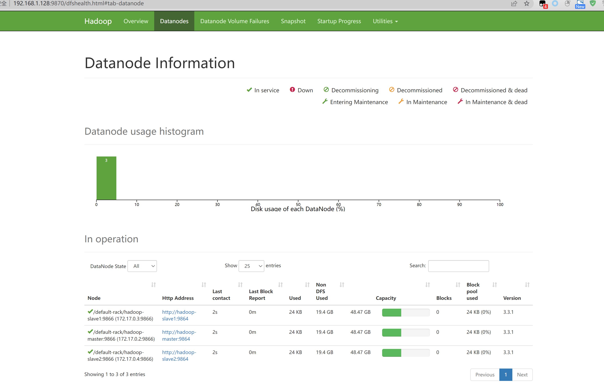

# 介绍

使用docker 一键搭建hadoop 集群 ,包含1个namenode，2个datanode（仅作学习和测试使用)

# 使用方法

**注意：以下命令请用root权限运行,否则会提示权限不足**

```shell
# docker network create --driver=bridge hadoop
# bash  ./start-container.sh
```

如想进入hadoop容器内 以root权限运行

```shell
# docker exec -it master bash
```

## Hadoop网页管理地址

* NameNode: http://<主机ip地址>:9870
* ResourceManager: http://<主机ip地址>:8088

  

## **运行wordcount测试**

```shell
./run-wordcount.sh
```

tips:该命令请在docker容器内运行

### 运行结果

```apache
input file1.txt:
Hello Hadoop
input file2.txt:
Hello Docker
wordcount output:
Docker	1
Hadoop	1
Hello	2
```

# 注意事项

* 在运行 start-container.sh 后请勿再次运行该命令，再次运行会删除原有镜像，数据会消失。

来自
[kiwenlau/hadoop-cluster-docker](https://github.com/kiwenlau/hadoop-cluster-docker) [墨天轮/Walrus](https://www.modb.pro/db/78682)
仅作打包和升级
